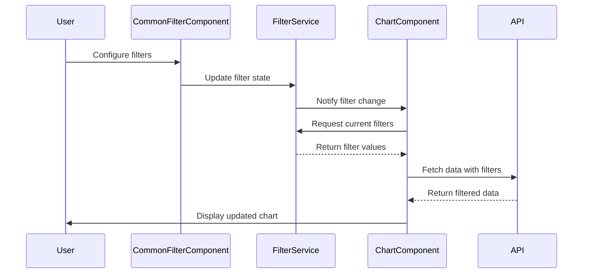

# Common Filter System - Example Usage

## Dashboard Layout

```
+-----------------------------------------------------+
| Common Filter Widget (Draggable)                    |
|                                                     |
| [Category ▼] [Status ▼] [Date Range] [Active -toggle]|
| [Save Preset] [Preset Selector] [Reset]             |
+-----------------------------------------------------+
| +-----------+  +-----------+  +-----------+          |
| | Bar Chart |  | Line Chart|  | Pie Chart |          |
| |           |  |           |  |           |          |
| |           |  |           |  |           |          |
| +-----------+  +-----------+  +-----------+          |
|                                                     |
| +-----------+  +-----------+  +-----------+          |
| | Table     |  | Map       |  | KPI Cards |          |
| |           |  |           |  |           |          |
| |           |  |           |  |           |          |
| +-----------+  +-----------+  +-----------+          |
+-----------------------------------------------------+
```

## Filter Configuration Example

### 1. Creating Filter Definitions

```typescript
// In CommonFilterComponent or dashboard initialization
const filters: Filter[] = [
  {
    id: 'category',
    field: 'product_category',
    label: 'Category',
    type: 'dropdown',
    options: ['Electronics', 'Clothing', 'Home & Garden', 'Books', 'Sports']
  },
  {
    id: 'status',
    field: 'order_status',
    label: 'Status',
    type: 'multiselect',
    options: ['Pending', 'Processing', 'Shipped', 'Delivered', 'Cancelled']
  },
  {
    id: 'date_range',
    field: 'order_date',
    label: 'Order Date',
    type: 'date-range'
  },
  {
    id: 'active',
    field: 'is_active',
    label: 'Active Orders',
    type: 'toggle'
  }
];

// Set filters in the service
filterService.setFilters(filters);
```

### 2. Setting Initial Filter Values

```typescript
// Set initial values
filterService.updateFilterValue('category', 'Electronics');
filterService.updateFilterValue('status', ['Processing', 'Shipped']);
filterService.updateFilterValue('date_range', {
  start: '2023-01-01',
  end: '2023-12-31'
});
filterService.updateFilterValue('active', true);
```

### 3. Chart Component Integration

```typescript
// In bar-chart.component.ts
export class BarChartComponent implements OnInit, OnChanges, OnDestroy {
  private subscriptions: Subscription[] = [];

  constructor(
    private dashboardService: Dashboard3Service,
    private filterService: FilterService
  ) { }

  ngOnInit(): void {
    // Subscribe to filter changes
    this.subscriptions.push(
      this.filterService.filterState$.subscribe(filters => {
        this.refreshData();
      })
    );
    
    // Load initial data
    this.fetchChartData();
  }

  fetchChartData(): void {
    // Get current filter values
    const filterValues = this.filterService.getFilterValues();
    
    // Build filter parameters for API
    let filterParams = '';
    if (Object.keys(filterValues).length > 0) {
      const filterObj = {};
      
      // Add base filters first
      if (this.baseFilters && this.baseFilters.length > 0) {
        this.baseFilters.forEach(filter => {
          if (filter.field && filter.value) {
            filterObj[filter.field] = filter.value;
          }
        });
      }
      
      // Add common filters
      Object.keys(filterValues).forEach(key => {
        const value = filterValues[key];
        if (value !== undefined && value !== null && value !== '') {
          filterObj[key] = value;
        }
      });
      
      if (Object.keys(filterObj).length > 0) {
        filterParams = JSON.stringify(filterObj);
      }
    }
    
    // Make API call with filters
    this.dashboardService.getChartData(
      this.table, 
      'bar', 
      this.xAxis, 
      this.yAxis, 
      this.connection, 
      '', 
      '', 
      filterParams
    ).subscribe(data => {
      // Handle response
      this.processChartData(data);
    });
  }

  refreshData(): void {
    this.fetchChartData();
  }

  ngOnDestroy(): void {
    this.subscriptions.forEach(sub => sub.unsubscribe());
  }
}
```

### 4. API Endpoint Example

```javascript
// Backend API endpoint example
app.get('/chart/getdashjson/bar', (req, res) => {
  const {
    tableName,
    xAxis,
    yAxes,
    sureId,
    filters // JSON string of filters
  } = req.query;
  
  // Parse filters
  let filterObj = {};
  if (filters) {
    try {
      filterObj = JSON.parse(filters);
    } catch (e) {
      console.error('Failed to parse filters:', e);
    }
  }
  
  // Build database query with filters
  let query = `SELECT ${xAxis}, ${yAxes} FROM ${tableName}`;
  const whereConditions = [];
  
  // Add filter conditions
  Object.keys(filterObj).forEach(field => {
    const value = filterObj[field];
    if (Array.isArray(value)) {
      // Handle multiselect (IN clause)
      const values = value.map(v => `'${v}'`).join(',');
      whereConditions.push(`${field} IN (${values})`);
    } else if (typeof value === 'object' && value.start && value.end) {
      // Handle date range
      whereConditions.push(`${field} BETWEEN '${value.start}' AND '${value.end}'`);
    } else if (typeof value === 'boolean') {
      // Handle boolean
      whereConditions.push(`${field} = ${value}`);
    } else {
      // Handle text and other values
      whereConditions.push(`${field} = '${value}'`);
    }
  });
  
  if (whereConditions.length > 0) {
    query += ` WHERE ${whereConditions.join(' AND ')}`;
  }
  
  // Execute query and return results
  database.query(query, (err, results) => {
    if (err) {
      res.status(500).json({ error: err.message });
    } else {
      res.json({
        chartLabels: results.map(row => row[xAxis]),
        chartData: [{
          data: results.map(row => row[yAxes]),
          label: yAxes
        }]
      });
    }
  });
});
```

## Filter Presets Example

### Saving a Preset

```typescript
// Save current filter state as a preset
const presetName = 'Q4 2023 Sales';
filterService.savePreset(presetName);

// Preset is now available in the presets list
const presets = filterService.getPresets(); // ['Q4 2023 Sales', ...]
```

### Loading a Preset

```typescript
// Load a saved preset
filterService.loadPreset('Q4 2023 Sales');

// All charts will automatically refresh with the preset filters
```

## Cross-Filtering Example

```typescript
// In a chart component, handle click events
onBarClick(event: any): void {
  const clickedCategory = event.active[0]._model.label;
  
  // Update the category filter
  this.filterService.updateFilterValue('category', clickedCategory);
  
  // All other charts will automatically update
}
```

## URL Synchronization Example

```typescript
// Update URL when filters change
this.filterService.filterState$.subscribe(filters => {
  const queryParams = new URLSearchParams();
  
  Object.keys(filters).forEach(key => {
    const value = filters[key];
    if (value !== undefined && value !== null && value !== '') {
      if (typeof value === 'object') {
        if (value.hasOwnProperty('start') && value.hasOwnProperty('end')) {
          // Date range
          if (value.start) queryParams.append(`${key}_start`, value.start);
          if (value.end) queryParams.append(`${key}_end`, value.end);
        } else {
          // Other objects as JSON
          queryParams.append(key, JSON.stringify(value));
        }
      } else {
        // Simple values
        queryParams.append(key, value.toString());
      }
    }
  });
  
  // Update browser URL
  const newUrl = `${window.location.pathname}?${queryParams.toString()}`;
  window.history.replaceState({}, '', newUrl);
});

// Load filters from URL on page load
ngOnInit(): void {
  const urlParams = new URLSearchParams(window.location.search);
  const filterState: any = {};
  
  // Parse URL parameters back into filter state
  for (const [key, value] of urlParams.entries()) {
    if (key.endsWith('_start')) {
      const fieldName = key.replace('_start', '');
      filterState[fieldName] = filterState[fieldName] || {};
      filterState[fieldName].start = value;
    } else if (key.endsWith('_end')) {
      const fieldName = key.replace('_end', '');
      filterState[fieldName] = filterState[fieldName] || {};
      filterState[fieldName].end = value;
    } else {
      try {
        filterState[key] = JSON.parse(value);
      } catch (e) {
        filterState[key] = value;
      }
    }
  }
  
  // Apply URL filters
  Object.keys(filterState).forEach(key => {
    this.filterService.updateFilterValue(key, filterState[key]);
  });
}
```

## Data Flow Diagram



This implementation provides a robust, scalable solution for managing common filters across multiple dashboard components with real-time updates and flexible configuration options.# Common Filter System - Example Usage

## Dashboard Layout

```
+-----------------------------------------------------+
| Common Filter Widget (Draggable)                    |
|                                                     |
| [Category ▼] [Status ▼] [Date Range] [Active -toggle]|
| [Save Preset] [Preset Selector] [Reset]             |
+-----------------------------------------------------+
| +-----------+  +-----------+  +-----------+          |
| | Bar Chart |  | Line Chart|  | Pie Chart |          |
| |           |  |           |  |           |          |
| |           |  |           |  |           |          |
| +-----------+  +-----------+  +-----------+          |
|                                                     |
| +-----------+  +-----------+  +-----------+          |
| | Table     |  | Map       |  | KPI Cards |          |
| |           |  |           |  |           |          |
| |           |  |           |  |           |          |
| +-----------+  +-----------+  +-----------+          |
+-----------------------------------------------------+
```

## Filter Configuration Example

### 1. Creating Filter Definitions

```typescript
// In CommonFilterComponent or dashboard initialization
const filters: Filter[] = [
  {
    id: 'category',
    field: 'product_category',
    label: 'Category',
    type: 'dropdown',
    options: ['Electronics', 'Clothing', 'Home & Garden', 'Books', 'Sports']
  },
  {
    id: 'status',
    field: 'order_status',
    label: 'Status',
    type: 'multiselect',
    options: ['Pending', 'Processing', 'Shipped', 'Delivered', 'Cancelled']
  },
  {
    id: 'date_range',
    field: 'order_date',
    label: 'Order Date',
    type: 'date-range'
  },
  {
    id: 'active',
    field: 'is_active',
    label: 'Active Orders',
    type: 'toggle'
  }
];

// Set filters in the service
filterService.setFilters(filters);
```

### 2. Setting Initial Filter Values

```typescript
// Set initial values
filterService.updateFilterValue('category', 'Electronics');
filterService.updateFilterValue('status', ['Processing', 'Shipped']);
filterService.updateFilterValue('date_range', {
  start: '2023-01-01',
  end: '2023-12-31'
});
filterService.updateFilterValue('active', true);
```

### 3. Chart Component Integration

```typescript
// In bar-chart.component.ts
export class BarChartComponent implements OnInit, OnChanges, OnDestroy {
  private subscriptions: Subscription[] = [];

  constructor(
    private dashboardService: Dashboard3Service,
    private filterService: FilterService
  ) { }

  ngOnInit(): void {
    // Subscribe to filter changes
    this.subscriptions.push(
      this.filterService.filterState$.subscribe(filters => {
        this.refreshData();
      })
    );
    
    // Load initial data
    this.fetchChartData();
  }

  fetchChartData(): void {
    // Get current filter values
    const filterValues = this.filterService.getFilterValues();
    
    // Build filter parameters for API
    let filterParams = '';
    if (Object.keys(filterValues).length > 0) {
      const filterObj = {};
      
      // Add base filters first
      if (this.baseFilters && this.baseFilters.length > 0) {
        this.baseFilters.forEach(filter => {
          if (filter.field && filter.value) {
            filterObj[filter.field] = filter.value;
          }
        });
      }
      
      // Add common filters
      Object.keys(filterValues).forEach(key => {
        const value = filterValues[key];
        if (value !== undefined && value !== null && value !== '') {
          filterObj[key] = value;
        }
      });
      
      if (Object.keys(filterObj).length > 0) {
        filterParams = JSON.stringify(filterObj);
      }
    }
    
    // Make API call with filters
    this.dashboardService.getChartData(
      this.table, 
      'bar', 
      this.xAxis, 
      this.yAxis, 
      this.connection, 
      '', 
      '', 
      filterParams
    ).subscribe(data => {
      // Handle response
      this.processChartData(data);
    });
  }

  refreshData(): void {
    this.fetchChartData();
  }

  ngOnDestroy(): void {
    this.subscriptions.forEach(sub => sub.unsubscribe());
  }
}
```

### 4. API Endpoint Example

```javascript
// Backend API endpoint example
app.get('/chart/getdashjson/bar', (req, res) => {
  const {
    tableName,
    xAxis,
    yAxes,
    sureId,
    filters // JSON string of filters
  } = req.query;
  
  // Parse filters
  let filterObj = {};
  if (filters) {
    try {
      filterObj = JSON.parse(filters);
    } catch (e) {
      console.error('Failed to parse filters:', e);
    }
  }
  
  // Build database query with filters
  let query = `SELECT ${xAxis}, ${yAxes} FROM ${tableName}`;
  const whereConditions = [];
  
  // Add filter conditions
  Object.keys(filterObj).forEach(field => {
    const value = filterObj[field];
    if (Array.isArray(value)) {
      // Handle multiselect (IN clause)
      const values = value.map(v => `'${v}'`).join(',');
      whereConditions.push(`${field} IN (${values})`);
    } else if (typeof value === 'object' && value.start && value.end) {
      // Handle date range
      whereConditions.push(`${field} BETWEEN '${value.start}' AND '${value.end}'`);
    } else if (typeof value === 'boolean') {
      // Handle boolean
      whereConditions.push(`${field} = ${value}`);
    } else {
      // Handle text and other values
      whereConditions.push(`${field} = '${value}'`);
    }
  });
  
  if (whereConditions.length > 0) {
    query += ` WHERE ${whereConditions.join(' AND ')}`;
  }
  
  // Execute query and return results
  database.query(query, (err, results) => {
    if (err) {
      res.status(500).json({ error: err.message });
    } else {
      res.json({
        chartLabels: results.map(row => row[xAxis]),
        chartData: [{
          data: results.map(row => row[yAxes]),
          label: yAxes
        }]
      });
    }
  });
});
```

## Filter Presets Example

### Saving a Preset

```typescript
// Save current filter state as a preset
const presetName = 'Q4 2023 Sales';
filterService.savePreset(presetName);

// Preset is now available in the presets list
const presets = filterService.getPresets(); // ['Q4 2023 Sales', ...]
```

### Loading a Preset

```typescript
// Load a saved preset
filterService.loadPreset('Q4 2023 Sales');

// All charts will automatically refresh with the preset filters
```

## Cross-Filtering Example

```typescript
// In a chart component, handle click events
onBarClick(event: any): void {
  const clickedCategory = event.active[0]._model.label;
  
  // Update the category filter
  this.filterService.updateFilterValue('category', clickedCategory);
  
  // All other charts will automatically update
}
```

## URL Synchronization Example

```typescript
// Update URL when filters change
this.filterService.filterState$.subscribe(filters => {
  const queryParams = new URLSearchParams();
  
  Object.keys(filters).forEach(key => {
    const value = filters[key];
    if (value !== undefined && value !== null && value !== '') {
      if (typeof value === 'object') {
        if (value.hasOwnProperty('start') && value.hasOwnProperty('end')) {
          // Date range
          if (value.start) queryParams.append(`${key}_start`, value.start);
          if (value.end) queryParams.append(`${key}_end`, value.end);
        } else {
          // Other objects as JSON
          queryParams.append(key, JSON.stringify(value));
        }
      } else {
        // Simple values
        queryParams.append(key, value.toString());
      }
    }
  });
  
  // Update browser URL
  const newUrl = `${window.location.pathname}?${queryParams.toString()}`;
  window.history.replaceState({}, '', newUrl);
});

// Load filters from URL on page load
ngOnInit(): void {
  const urlParams = new URLSearchParams(window.location.search);
  const filterState: any = {};
  
  // Parse URL parameters back into filter state
  for (const [key, value] of urlParams.entries()) {
    if (key.endsWith('_start')) {
      const fieldName = key.replace('_start', '');
      filterState[fieldName] = filterState[fieldName] || {};
      filterState[fieldName].start = value;
    } else if (key.endsWith('_end')) {
      const fieldName = key.replace('_end', '');
      filterState[fieldName] = filterState[fieldName] || {};
      filterState[fieldName].end = value;
    } else {
      try {
        filterState[key] = JSON.parse(value);
      } catch (e) {
        filterState[key] = value;
      }
    }
  }
  
  // Apply URL filters
  Object.keys(filterState).forEach(key => {
    this.filterService.updateFilterValue(key, filterState[key]);
  });
}
```

## Data Flow Diagram


This implementation provides a robust, scalable solution for managing common filters across multiple dashboard components with real-time updates and flexible configuration options.