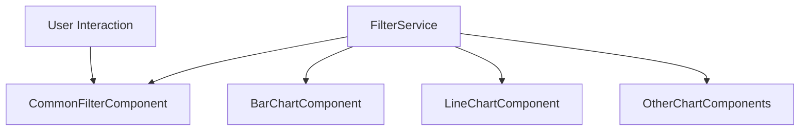

# Common Filter Implementation Guide

## Overview

This implementation provides a centralized filter system that allows users to control multiple charts simultaneously through a draggable filter widget. The system consists of:

1. **FilterService** - Central service managing filter definitions and state
2. **CommonFilterComponent** - Draggable widget for configuring filters
3. **Chart Components** - Updated chart components that subscribe to filter changes

## Architecture



## Key Components

### 1. FilterService

The central service that manages:
- Filter definitions (type, options, labels)
- Current filter values
- Filter presets
- Query parameter generation for API calls

#### Methods:
- `addFilter()` - Add a new filter
- `removeFilter()` - Remove a filter
- `updateFilterValue()` - Update a filter's value
- `getFilterValues()` - Get current filter values
- `resetFilters()` - Reset all filters to default values
- `savePreset()` - Save current filter state as a preset
- `loadPreset()` - Load a saved preset
- `buildQueryParams()` - Generate query parameters for API calls

### 2. CommonFilterComponent

A draggable widget that provides the UI for:
- Adding/removing filters
- Configuring filter properties
- Setting filter values
- Managing presets

### 3. Chart Components

Updated chart components that:
- Subscribe to filter changes
- Automatically refresh when filters change
- Include filter values in API calls

## Implementation Details

### Filter Types Supported

1. **Text** - Simple text input
2. **Dropdown** - Single selection from options
3. **Multiselect** - Multiple selection from options
4. **Date Range** - Start and end date selection
5. **Toggle** - Boolean on/off switch

### Data Flow

1. User adds/configures filters in CommonFilterComponent
2. FilterService stores filter definitions and values
3. Chart components subscribe to FilterService.filterState$
4. When filters change, charts automatically refresh
5. Filter values are included in API calls as query parameters

### API Integration

Filters are passed to the backend as query parameters:
- Text filter: `name=John`
- Dropdown filter: `category=A`
- Multiselect filter: `tags=["tag1","tag2"]`
- Date range filter: `date_start=2023-01-01&date_end=2023-12-31`
- Toggle filter: `isActive=true`

## Usage Examples

### Adding the Common Filter Widget

1. Drag the "Common Filter" widget from the component palette
2. Place it at the top of the dashboard
3. Configure filters as needed

### Creating Filters

```typescript
// Add a text filter
const textFilter: Filter = {
  id: 'name',
  field: 'name',
  label: 'Name',
  type: 'text'
};

// Add a dropdown filter
const dropdownFilter: Filter = {
  id: 'category',
  field: 'category',
  label: 'Category',
  type: 'dropdown',
  options: ['A', 'B', 'C']
};
```

### Consuming Filters in Charts

```typescript
// In chart component
constructor(private filterService: FilterService) {}

ngOnInit(): void {
  // Subscribe to filter changes
  this.subscriptions.push(
    this.filterService.filterState$.subscribe(filters => {
      this.fetchChartData();
    })
  );
}

fetchChartData(): void {
  // Get current filter values
  const filterValues = this.filterService.getFilterValues();
  
  // Include in API call
  const queryParams = this.filterService.buildQueryParams();
  // Use queryParams in API call
}
```

## JSON Structures

### Filter Definition

```json
{
  "id": "filter_123456",
  "field": "category",
  "label": "Category",
  "type": "dropdown",
  "options": ["Electronics", "Clothing", "Books"],
  "value": "Electronics"
}
```

### Filter State

```json
{
  "category": "Electronics",
  "price_range": {
    "start": 100,
    "end": 500
  },
  "in_stock": true,
  "tags": ["sale", "featured"]
}
```

### API Response Format

```json
{
  "chartLabels": ["Jan", "Feb", "Mar"],
  "chartData": [
    {
      "data": [10, 20, 30],
      "label": "Sales"
    }
  ]
}
```

## Cross-Filtering Support

Charts can also support cross-filtering where clicking on one chart updates the common filters:

1. Implement click handlers in chart components
2. Update filter values through FilterService
3. All other charts automatically refresh

Example:
```typescript
onChartClick(dataPoint: any): void {
  // Update a filter based on chart click
  this.filterService.updateFilterValue('category', dataPoint.category);
}
```

## Preset Management

Users can save and load filter presets:

1. Configure desired filters
2. Enter a preset name and click "Save Preset"
3. Select preset from dropdown to load
4. Delete presets as needed

## URL Synchronization

Filter states can be synchronized with URL query parameters for shareable dashboards:

1. On filter change, update URL query parameters
2. On page load, read filters from URL
3. Apply filters to charts

## Optional Enhancements

1. **Real-time Updates** - WebSocket integration for live data
2. **Advanced Filtering** - Custom filter expressions
3. **Filter Dependencies** - Conditional filters based on other filter values
4. **Analytics** - Track most used filters and combinations